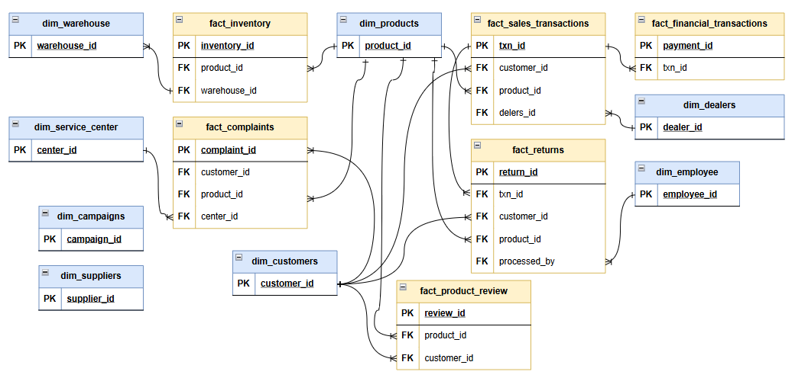

# 📖 SAMSUNG DATA ENGINEERING — GOLD LAYER DATA CATALOG

**Prepared by:** Harsh Belekar
**Layer:** Gold — Analytics & Reporting
**Schema:** `gold`
**Upstream Layer:** Silver (`silver.hrm_*` | `silver.sci_*` | `silver.as2_*` | `silver.crm_*` | `silver.snd_*` | `silver.fip_*`)
**Implementation:** PostgreSQL Views (no storage — live reads from Silver)
**Total Views:** 14 (8 Dimensions + 6 Facts)
**Last Updated:** May 2026

---

## TABLE OF CONTENTS

1. [Catalog Overview](#1--catalog-overview)
2. [Architecture — Bronze → Silver → Gold](#2-️-architecture--bronze--silver--gold)
3. [Silver Domain Prefix Reference](#3-️-silver-domain-prefix-reference)
4. [Gold Layer — Schema Map](#4-️-gold-layer--schema)
5. [Dimension Tables](#5--dimension-tables)
   - [dim_products](#51-dim_products)
   - [dim_warehouses](#52-dim_warehouses)
   - [dim_service_centers](#53-dim_service_centers)
   - [dim_customers](#54-dim_customers)
   - [dim_dealers](#55-dim_dealers)
   - [dim_suppliers](#56-dim_suppliers)
   - [dim_campaigns](#57-dim_campaigns)
   - [dim_employees](#58-dim_employees)
6. [Fact Tables](#6--fact-tables)
   - [fact_inventory](#61-fact_inventory)
   - [fact_sales_transactions](#62-fact_sales_transactions)
   - [fact_complaints](#63-fact_complaints)
   - [fact_returns](#64-fact_returns)
   - [fact_financial_transactions](#65-fact_financial_transactions)
   - [fact_product_reviews](#66-fact_product_reviews)
7. [Relationships & Join Guide](#7--relationships--join-guide)
8. [Sample Queries](#8--sample-queries)
9. [Data Governance](#9--data-governance)

---

## 1. 🚀 CATALOG OVERVIEW

This Data Catalog is the **single source of truth** for every analyst, data scientist, and Power BI developer working with Samsung India's Gold layer. It documents every view, every column, every data type, and every business rule applied during the Silver → Gold transformation.

The Gold layer is implemented as **PostgreSQL views** — not physical tables. Every query against a Gold view reads live, cleaned data directly from the Silver layer in real time. This means the Gold layer is always current and requires no scheduled refresh job.

**What the Gold layer is designed for:**

The Gold layer serves two consumer groups simultaneously. The first group is **Power BI dashboard developers** who connect directly to Gold views to build revenue dashboards, after-sales health reports, and inventory monitoring panels. The second group is **SQL analysts** who write ad-hoc queries against Gold views to answer business questions without needing to understand the underlying Bronze messiness or Silver cleaning logic.

**What the Gold layer is NOT:**

The Gold layer does not store pre-aggregated data. It does not contain mart tables, rollups, or KPI summaries — those belong in a separate analytical layer above Gold. Every row in a Gold fact view corresponds to exactly one source transaction.

---

## 2. 🏗️ ARCHITECTURE — BRONZE → SILVER → GOLD

```
┌─────────────────────────────────────────────────────────┐
│  RAW FILES  (CSV / JSON / XLSX)                         │
│  14 files · ~2,000,000 rows · Mixed formats & nulls     │
└────────────────────────┬────────────────────────────────┘
                         │  Python Generator (Main.py)
                         ▼
┌─────────────────────────────────────────────────────────┐
│  BRONZE SCHEMA   (bronze.*)                             │
│  14 tables · All columns TEXT · No constraints          │
│  Raw ingestion — exactly as received                    │
└────────────────────────┬────────────────────────────────┘
                         │  SQL Cleaning Views (cleaning.*)
                         │  fn_to_boolean · fn_clean_phone
                         │  fn_parse_date · fn_salary_to_annual
                         │  fn_parse_gst_pct · Deduplication
                         ▼
┌─────────────────────────────────────────────────────────┐
│  SILVER SCHEMA   (silver.hrm_* | sci_* | as2_* | ...)   │
│  14 tables · Typed columns · FK constraints             │
│  Cleaned, standardised, deduplicated                    │
└────────────────────────┬────────────────────────────────┘
                         │  Gold DDL Views (no transformation)
                         │  Semantic renaming + column selection
                         ▼
┌─────────────────────────────────────────────────────────┐
│  GOLD SCHEMA   (gold.*)                ← YOU ARE HERE   │
│  14 views · Star Schema                                 │
│  8 Dimensions + 6 Facts                                 │
│  Business-ready · Analytics & Reporting                 │
└─────────────────────────────────────────────────────────┘
                         │
              ┌──────────┴──────────┐
              ▼                     ▼
       Power BI Reports      Ad-hoc SQL Analysis
```

### Data Warehouse Architecture


---

## 3. 🏷️ SILVER DOMAIN PREFIX REFERENCE

Silver layer tables are named with a **3-letter domain prefix** that indicates which business domain owns the data. Gold views map directly onto these Silver tables.

| Prefix | Domain | Business Area | Silver Tables |
|---|---|---|---|
| `hrm_` | Human Resources & Marketing | People + Campaigns + Products | `hrm_products`, `hrm_employees`, `hrm_campaigns` |
| `sci_` | Supply Chain & Inventory | Warehouses + Suppliers + Stock | `sci_warehouses`, `sci_suppliers`, `sci_inventory` |
| `as2_` | After-Sales Service | Complaints + Returns + Centres | `as2_service_centers`, `as2_complaints`, `as2_returns` |
| `crm_` | Customer Relationship | Customers + Reviews | `crm_customers`, `crm_product_reviews` |
| `snd_` | Sales & Distribution | Transactions + Dealers | `snd_dealers`, `snd_sales_transactions` |
| `fip_` | Finance & Payments | Payments + GST | `fip_financial_transactions` |

> **Note for analysts:** You never need to query Silver directly. All Silver tables are fully exposed through Gold views with clean, business-friendly column names.

---

## 4. 🗺️ GOLD LAYER — SCHEMA



### Views at a Glance

| View Name | Type | Rows (approx.) | Source Silver Table | Business Domain |
|---|---|---|---|---|
| `dim_products` | Dimension | 2,000 | `hrm_products` | Product Catalogue |
| `dim_warehouses` | Dimension | 25 | `sci_warehouses` | Supply Chain |
| `dim_service_centers` | Dimension | 1,200 | `as2_service_centers` | After-Sales |
| `dim_customers` | Dimension | 200,000 | `crm_customers` | CRM |
| `dim_dealers` | Dimension | 10,000 | `snd_dealers` | Sales |
| `dim_suppliers` | Dimension | 500 | `sci_suppliers` | Procurement |
| `dim_campaigns` | Dimension | 1,000 | `hrm_campaigns` | Marketing |
| `dim_employees` | Dimension | 15,000 | `hrm_employees` | HR |
| `fact_inventory` | Fact | 100,000 | `sci_inventory` | Supply Chain |
| `fact_sales_transactions` | Fact | 750,000 | `snd_sales_transactions` | Sales |
| `fact_complaints` | Fact | 200,000 | `as2_complaints` | After-Sales |
| `fact_returns` | Fact | ~77,250 | `as2_returns` | After-Sales |
| `fact_financial_transactions` | Fact | ~663,000 | `fip_financial_transactions` | Finance |
| `fact_product_reviews` | Fact | 50,000 | `crm_product_reviews` | CRM |

---

## 5. 📐 DIMENSION TABLES

Dimension tables provide the **descriptive context** for every metric in the fact tables. They answer the "who, what, where, which" questions. Every dimension can be joined to one or more fact tables using its primary key.

---

### 5.1 `dim_products`

**Purpose:** Samsung India product master — the complete catalogue of every product SKU available for sale, service, or review.

**Source:** `silver.hrm_products`
**Primary Key:** `product_id`
**Row Grain:** One row per unique product SKU / colour variant

**Used by:** `fact_inventory`, `fact_sales_transactions`, `fact_complaints`, `fact_returns`, `fact_product_reviews`

#### Column Reference

| Column | Data Type | Nullable | Description | Example Value | Notes |
|---|---|---|---|---|---|
| `product_id` | VARCHAR(10) | NOT NULL | Unique product identifier | `PROD0001` | PK. Format: PROD + 4-digit number |
| `sku` | VARCHAR(30) | NOT NULL | Samsung Stock Keeping Unit code | `SM-S938BZKGINS` | Encodes model + colour + region (GINS = India) |
| `product_name` | VARCHAR(200) | NOT NULL | Full product name including colour variant | `Galaxy S25 Ultra Phantom Black` | Use for display labels in reports |
| `category` | VARCHAR(50) | Yes | Top-level product category | `Smartphones` | Values: Smartphones, Tablets, Televisions, Air Conditioners, Washing Machines, Refrigerators |
| `subcategory` | VARCHAR(50) | Yes | Product line within category | `Galaxy S Series` | e.g. Galaxy A Series, Neo QLED, Wind-Free, Front Load |
| `mrp_inr` | NUMERIC(10,2) | Yes | Maximum Retail Price in Indian Rupees | `139999.00` | ~3% NULL — product not yet priced. Do not use as actual selling price |
| `launch_date_india` | DATE | Yes | Official India market launch date | `2024-01-17` | Useful for cohort analysis (new vs legacy products) |
| `ram_gb` | SMALLINT | Yes | RAM capacity in gigabytes | `12` | NULL for TVs, ACs, Washing Machines, Refrigerators |
| `storage_gb` | SMALLINT | Yes | Internal storage in gigabytes | `512` | NULL for non-digital appliances |
| `display_inches` | NUMERIC(4,1) | Yes | Screen size in inches | `6.9` | NULL for ACs, Washing Machines, Refrigerators |
| `bis_certified` | BOOLEAN | Yes | Bureau of Indian Standards certification status | `true` | Mandatory for India sales. NULL = certification status unknown |
| `warranty_years` | SMALLINT | Yes | Standard warranty period | `1` | Values: 1 or 2 years |
| `color_variants` | SMALLINT | Yes | Number of colour options available | `4` | Range: 1–6 |

#### Category Quick Reference

| Category | Subcategories | Has RAM/Storage | Has Display |
|---|---|---|---|
| Smartphones | Galaxy S / A / M / Z Series | ✅ | ✅ |
| Tablets | Galaxy Tab S / Tab A | ✅ | ✅ |
| Televisions | Crystal 4K / QLED / Neo QLED | ❌ | ✅ (screen size) |
| Air Conditioners | Wind-Free / Digital Inverter | ❌ | ❌ |
| Washing Machines | Front Load / Top Load | ❌ | ❌ |
| Refrigerators | Single Door / Double Door / French Door | ❌ | ❌ |

---

### 5.2 `dim_warehouses`

**Purpose:** Samsung India warehouse master — the **25 fixed distribution hubs** and manufacturing facilities that store and ship all products across India.

**Source:** `silver.sci_warehouses`
**Primary Key:** `warehouse_id`
**Row Grain:** One row per warehouse facility

**Used by:** `fact_inventory`

#### Column Reference

| Column | Data Type | Nullable | Description | Example Value | Notes |
|---|---|---|---|---|---|
| `warehouse_id` | VARCHAR(5) | NOT NULL | Unique warehouse identifier | `WH001` | PK. Format: WH + 3-digit number (WH001–WH025) |
| `warehouse_name` | VARCHAR(100) | NOT NULL | Full facility name | `Noida Main Warehouse` | Includes city in name for quick identification |
| `city` | VARCHAR(50) | NOT NULL | City where the facility is located | `Noida` | |
| `state` | VARCHAR(50) | NOT NULL | State where the facility is located | `Uttar Pradesh` | |
| `pincode` | CHAR(6) | Yes | 6-digit postal code | `201301` | ~5% NULL |
| `capacity_units` | INTEGER | Yes | Maximum storage capacity in product units | `150000` | ~8% NULL — capacity data not available for some sites |
| `latitude` | NUMERIC(9,6) | Yes | GPS latitude coordinate | `28.535500` | Cleaned from bronze — comma decimal separator fixed |
| `longitude` | NUMERIC(9,6) | Yes | GPS longitude coordinate | `77.391000` | Use with Power BI map visuals for warehouse location pins |
| `type` | VARCHAR(30) | NOT NULL | Facility type classification | `Primary Distribution` | Values: Primary Distribution, Regional Hub, Distribution Center, Manufacturing Hub |

#### Warehouse Type Reference

| Type | Count | Role |
|---|---|---|
| Primary Distribution | 2 | Main national hubs — Noida & Delhi NCR |
| Manufacturing Hub | 1 | Sriperumbudur (Samsung's India factory) |
| Regional Hub | ~11 | State-level distribution centres |
| Distribution Center | ~11 | City-level last-mile distribution |

---

### 5.3 `dim_service_centers`

**Purpose:** Samsung India authorised service centre master — the **1,200 centres** that handle warranty repairs, out-of-warranty service, and complaint resolution.

**Source:** `silver.as2_service_centers`
**Primary Key:** `center_id`
**Row Grain:** One row per service centre

**Used by:** `fact_complaints`

#### Column Reference

| Column | Data Type | Nullable | Description | Example Value | Notes |
|---|---|---|---|---|---|
| `center_id` | VARCHAR(6) | NOT NULL | Unique centre identifier | `SC0001` | PK. Format: SC + 4-digit number |
| `center_name` | VARCHAR(150) | NOT NULL | Full centre name | `Samsung Service Center Mumbai` | Includes centre type and city |
| `tier` | VARCHAR(20) | Yes | Service quality tier | `Premium` | Values: Premium, Standard, Brand Shop. NULL = tier not classified |
| `city` | VARCHAR(50) | NOT NULL | City where centre is located | `Mumbai` | |
| `state` | VARCHAR(50) | NOT NULL | State | `Maharashtra` | |
| `pincode` | CHAR(6) | Yes | 6-digit postal code | `400001` | ~6% NULL |
| `phone` | VARCHAR(15) | Yes | Centre contact number | `02240123456` | ~3% NULL |
| `email` | VARCHAR(100) | Yes | Centre contact email | `sc0001@samsung-care.in` | ~5% NULL |
| `working_hours` | VARCHAR(50) | Yes | Operating hours | `9AM-7PM` | Multiple formats exist — treat as display string only |
| `capacity_per_day` | SMALLINT | Yes | Maximum repair cases per day | `80` | ~7% NULL. Range: 20–150 |
| `is_active` | BOOLEAN | NOT NULL | Whether centre is currently operational | `true` | Filter `WHERE is_active = true` for active-centre analysis |

#### Tier Quick Reference

| Tier | Description | Typical Capacity/Day |
|---|---|---|
| `Premium` | Flagship centres with full repair capabilities | 80–150 |
| `Standard` | Standard authorised service centres | 30–80 |
| `Brand Shop` | In-store service desks at Samsung Brand Stores | 20–40 |

---

### 5.4 `dim_customers`

**Purpose:** Samsung India customer master — **200,000 registered customers** with demographic, geographic, and CRM segmentation attributes.

**Source:** `silver.crm_customers`
**Primary Key:** `customer_id`
**Row Grain:** One row per registered customer account

**Used by:** `fact_sales_transactions`, `fact_complaints`, `fact_returns`, `fact_product_reviews`

#### Column Reference

| Column | Data Type | Nullable | Description | Example Value | Notes |
|---|---|---|---|---|---|
| `customer_id` | VARCHAR(11) | NOT NULL | Unique customer identifier | `CUST0000001` | PK. Format: CUST + 7-digit number |
| `full_name` | VARCHAR(100) | NOT NULL | Customer full name | `Priya Sharma` | Title Case — cleaned from Bronze mixed casing |
| `email` | VARCHAR(150) | Yes | Customer email address | `priya.sharma42@gmail.com` | ~2% NULL — duplicate Bronze emails were nulled in Silver |
| `phone` | CHAR(10) | Yes | 10-digit mobile number | `9876543210` | Cleaned from Bronze — +91 prefix and leading 0 removed. ~9% NULL after cleaning |
| `city` | VARCHAR(50) | Yes | Customer's city | `Mumbai` | |
| `state` | VARCHAR(50) | Yes | Customer's state | `Maharashtra` | 29 states + 7 UTs represented |
| `pincode` | CHAR(6) | Yes | 6-digit postal code | `400001` | ~6% NULL — invalid pincodes were removed during Silver cleaning |
| `gender` | VARCHAR(10) | Yes | Customer gender | `Female` | Values: Male, Female, Other. Cleaned from 7 Bronze encodings |
| `dob` | DATE | Yes | Date of birth | `1992-03-15` | Cleaned from 6 Bronze date formats. Use for age calculations |
| `segment` | VARCHAR(15) | NOT NULL | CRM customer segment | `Mid-Range` | Values: Premium (15%), Mid-Range (35%), Budget (40%), Enterprise (10%) |
| `registered_on` | DATE | NOT NULL | Account registration date | `2023-07-22` | Within 2022–2025 range |
| `is_active` | BOOLEAN | NOT NULL | Whether account is currently active | `true` | ~70% TRUE. Filter for active customers in acquisition analysis |

#### Segment Distribution

| Segment | Share | Typical Profile |
|---|---|---|
| Budget | 40% | M-Series / A-Series buyers, price-sensitive |
| Mid-Range | 35% | A-Series / Tab A buyers, value-conscious |
| Premium | 15% | S-Series / Z-Series / Tab S buyers |
| Enterprise | 10% | B2B buyers — bulk purchases through corporate channels |

---

### 5.5 `dim_dealers`

**Purpose:** Samsung India retail partner and dealer master — **10,000 stores** across online and offline channels.

**Source:** `silver.snd_dealers`
**Primary Key:** `dealer_id`
**Row Grain:** One row per store / dealer outlet

**Used by:** `fact_sales_transactions`

#### Column Reference

| Column | Data Type | Nullable | Description | Example Value | Notes |
|---|---|---|---|---|---|
| `dealer_id` | VARCHAR(8) | NOT NULL | Unique dealer identifier | `DLR00001` | PK. Format: DLR + 5-digit number |
| `dealer_name` | VARCHAR(150) | NOT NULL | Dealer outlet name | `Croma - Mumbai` | Typically "{Chain} - {City}" format |
| `store_type` | VARCHAR(40) | Yes | Type of retail outlet | `Large Format Retail` | Values: Samsung SmartCafé, Samsung Brand Store, Large Format Retail, Multi-Brand Outlet, Online Exclusive Partner. ~4% NULL |
| `chain` | VARCHAR(50) | NOT NULL | Parent retail chain name | `Croma` | Values: Croma, Reliance Digital, Vijay Sales, Poorvika Mobiles, Sangeetha Mobiles, Pai International, Big Electronics, Amazon IN, Flipkart, Samsung SmartCafé |
| `city` | VARCHAR(50) | Yes | City of the outlet | `Mumbai` | NULL for pure online channels |
| `state` | VARCHAR(50) | Yes | State of the outlet | `Maharashtra` | NULL for pure online channels |
| `tier` | VARCHAR(10) | Yes | Market tier classification | `Tier 1` | Values: Tier 1, Tier 2, Tier 3. ~5% NULL. Cleaned from 6 Bronze encodings |
| `contact_phone` | CHAR(10) | Yes | Dealer contact number | `9845012345` | |
| `active_since` | DATE | Yes | Date the dealer partnership began | `2018-04-01` | Historical range: 2010–2023 |
| `is_exclusive` | BOOLEAN | Yes | Whether dealer sells Samsung exclusively | `false` | ~15% TRUE — Samsung SmartCafé and Brand Stores |

---

### 5.6 `dim_suppliers`

**Purpose:** Samsung India supplier master — **500 component and logistics vendors** that supply parts for Samsung India's manufacturing and service operations.

**Source:** `silver.sci_suppliers`
**Primary Key:** `supplier_id`
**Row Grain:** One row per supplier company

**Used by:** Standalone dimension — not currently joined to any fact view. Available for procurement analytics.

#### Column Reference

| Column | Data Type | Nullable | Description | Example Value | Notes |
|---|---|---|---|---|---|
| `supplier_id` | VARCHAR(7) | NOT NULL | Unique supplier identifier | `SUP0001` | PK. Format: SUP + 4-digit number |
| `supplier_name` | VARCHAR(150) | NOT NULL | Supplier company name with legal suffix | `Dixon Technologies Pvt Ltd` | |
| `country` | VARCHAR(30) | NOT NULL | Supplier's country of operation | `India` | Top countries: India (40%), South Korea (20%), China (15%), Taiwan (8%) |
| `city` | VARCHAR(50) | Yes | Supplier's primary city | `Noida` | Indian city or international city e.g. Seoul, Shenzhen |
| `gstin` | VARCHAR(15) | Yes | Goods & Services Tax Identification Number | `27AAPFD1234A1Z5` | Only for Indian suppliers. ~10% of Indian suppliers are NULL. NULL for all overseas suppliers |
| `contact_email` | VARCHAR(150) | Yes | Procurement contact email | `procurement@dixontechxx.in` | |
| `payment_terms_days` | SMALLINT | Yes | Standard payment term in days | `45` | Values: 30, 45, 60. Cleaned from 8 Bronze string formats |
| `category` | VARCHAR(50) | Yes | Component category supplied | `Display Panels` | 15 categories: Display Panels, Batteries, Camera Modules, Memory Chips, Processors, etc. |
| `rating` | NUMERIC(3,1) | Yes | Supplier quality rating | `4.3` | Range: 1.0–5.0. ~5% NULL |
| `is_msme` | BOOLEAN | Yes | Micro, Small & Medium Enterprise status | `true` | ~30% TRUE — eligible for preferential payment terms |
| `contract_start` | DATE | Yes | Start date of current supply contract | `2020-06-01` | Historical range: 2015–2023 |

---

### 5.7 `dim_campaigns`

**Purpose:** Samsung India marketing campaign master — **1,000 campaigns** across digital, TV, outdoor, and in-store channels, covering festive seasons and product launches.

**Source:** `silver.hrm_campaigns`
**Primary Key:** `campaign_id`
**Row Grain:** One row per campaign

**Used by:** Standalone dimension — not currently joined to any fact view. Available for marketing analytics via campaign date ranges overlapping with `fact_sales_transactions.txn_date`.

#### Column Reference

| Column | Data Type | Nullable | Description | Example Value | Notes |
|---|---|---|---|---|---|
| `campaign_id` | VARCHAR(8) | NOT NULL | Unique campaign identifier | `CAMP0001` | PK. Format: CAMP + 4-digit number |
| `campaign_name` | VARCHAR(150) | NOT NULL | Campaign name | `Diwali Dhamaka Sale 2024` | Typically "{Festival/Theme} + {Year}" |
| `type` | VARCHAR(20) | NOT NULL | Campaign media type | `Digital` | Values: Digital, TV, Outdoor, In-Store, Social Media, Email, Influencer |
| `start_date` | DATE | NOT NULL | Campaign start date | `2024-10-15` | |
| `end_date` | DATE | Yes | Campaign end date | `2024-11-05` | ~4% NULL — ongoing campaigns or end date not set |
| `budget_inr` | NUMERIC(12,2) | Yes | Campaign spend budget in INR | `5000000.00` | ~7% NULL. Range: ₹5L – ₹5Cr |
| `discount_pct` | NUMERIC(4,1) | Yes | Discount percentage offered | `25.0` | Range: 5–40%. Cleaned from "30%" and "30" Bronze formats |
| `target_region` | VARCHAR(50) | Yes | Target geography | `Pan India` | Values: Pan India, North India, South India, West India, East India, or specific state names. ~3% NULL |
| `target_segment` | VARCHAR(20) | Yes | Target customer segment | `Youth` | Values: All, Premium, Youth, Family, Students, Corporate |
| `channel` | VARCHAR(30) | Yes | Sales channel associated | `Flipkart` | |
| `status` | VARCHAR(15) | Yes | Campaign execution status | `Completed` | Values: Active, Completed, Paused, Draft, Cancelled |

---

### 5.8 `dim_employees`

**Purpose:** Samsung India HR master — **15,000 employees** across all departments and office locations.

**Source:** `silver.hrm_employees`
**Primary Key:** `employee_id`
**Self-Referencing FK:** `manager_id` → `employee_id`

**Used by:** `fact_returns` (via `processed_by` column)

#### Column Reference

| Column | Data Type | Nullable | Description | Example Value | Notes |
|---|---|---|---|---|---|
| `employee_id` | VARCHAR(9) | NOT NULL | Unique employee identifier | `EMP000001` | PK. Format: EMP + 6-digit number |
| `full_name` | VARCHAR(100) | NOT NULL | Employee full name | `Rahul Sharma` | |
| `department` | VARCHAR(50) | Yes | Department name | `After Sales Service` | 14 departments — see table below. ~2% NULL |
| `designation` | VARCHAR(50) | Yes | Job title | `Senior Engineer` | 16 designation levels |
| `location` | VARCHAR(50) | Yes | Office location | `Noida HQ` | Values: Noida HQ, Sriperumbudur Factory, Bengaluru R&D, Mumbai Office, Chennai Office, Hyderabad Office, Kolkata Office, Pune Office, Delhi Office, Ahmedabad Office |
| `join_date` | DATE | Yes | Employment start date | `2021-03-15` | Cleaned from 6 Bronze date formats. Range: 2010–2024 |
| `salary_inr` | NUMERIC(12,2) | Yes | Annual salary in INR | `1800000.00` | **Cleaned from 3 Bronze formats** — "18 LPA", "150000" (monthly ×12), "18L". ~5% NULL |
| `manager_id` | VARCHAR(9) | Yes | Reporting manager's employee ID | `EMP000042` | Self-referencing FK → `employee_id`. NULL for top-level employees (no manager) |
| `gender` | VARCHAR(10) | Yes | Employee gender | `Male` | Values: Male (55%), Female (38%), Other (3%), NULL (4%) |
| `pf_number` | VARCHAR(20) | Yes | Provident Fund number | `MH/12345/678` | Format: `{State}/{5-digit}/{3-digit}`. ~6% NULL |
| `is_active` | BOOLEAN | NOT NULL | Current employment status | `true` | ~82% TRUE. FALSE = resigned/terminated |

#### Department Reference

| Department | Key Functions |
|---|---|
| Sales | Revenue generation, dealer management |
| Marketing | Campaigns, brand, digital |
| After Sales Service | Repairs, warranty, complaints |
| Customer Service | Call centre, helpdesk |
| R&D | Product development, innovation |
| Manufacturing | Sriperumbudur factory operations |
| Supply Chain | Procurement, logistics, inventory |
| Finance | Accounting, GST, payroll |
| HR | Recruitment, payroll, compliance |
| IT | Systems, infrastructure, data |
| Quality Assurance | QC, testing, standards |
| Logistics | Warehousing, shipping |
| Legal | Contracts, compliance |
| ESG & Sustainability | Environmental, social, governance |

---
