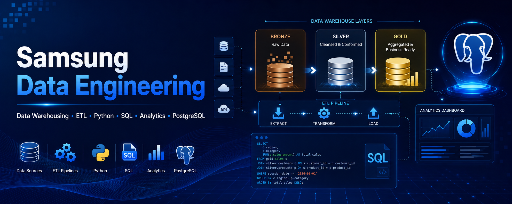
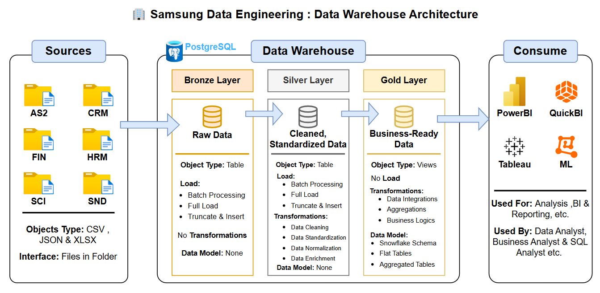

# 🏢 Samsung — Data Engineering Project



### End-to-End Data Engineering Project using Medallion Architecture 

**A fully End-to-End Data Engineering project — from Synthetic data generation to a production-grade three-layer Data Warehouse — built to demonstrate real-world data engineering skills using Python, SQL, and PostgreSQL.**

           

---

## 📌 Table of Contents

1. [Project Overview](#1--project-overview)
2. [Data Warehouse Architecture](#2--data-warehouse-architecture)
3. [Project Folder Structure](#3--project-folder-structure)
4. [Data Domains](#4--data-domains)
5. [Dataset Overview](#5--dataset-overview)
6. [Tech Stack](#6--tech-stack)
7. [Project Workflow — Step by Step](#7--project-workflow--step-by-step)
   - [Phase 1 — Synthetic Data Generation](#phase-1--synthetic-data-generation)
   - [Phase 2 — Database Setup](#phase-2--database-setup)
   - [Phase 3 — Bronze Layer](#phase-3--bronze-layer)
   - [Phase 4 — Silver Layer](#phase-4--silver-layer)
   - [Phase 5 — Gold Layer](#phase-5--gold-layer)
8. [Naming Conventions](#8--naming-conventions)
9. [Pipeline Execution Guide](#9--pipeline-execution-guide)
10. [Project Documentation](#10--project-documentation)
11. [Logs](#11--logs)
12. [Author](#-author)

---

## 1. 🚀 Project Overview

This project builds a **production-grade Data Warehouse** for Samsung India — from scratch — using the **Medallion Architecture (Bronze → Silver → Gold)**. The pipeline begins with synthetic data generation simulating Samsung India's real business operations across Sales, Finance, Customer Relations, After-Sales Service, Supply Chain, and Marketing, then processes that data through three structured warehouse layers into analytics-ready Gold views.

The project is implemented **twice** — once using **Python Scripts** and once using **SQL Scripts** — deliberately, to showcase proficiency in both approaches on the same problem.

### What This Project Covers

- ✅ Synthetic data generation — **2,000,000+ rows** across **14 tables** using Python
- ✅ Multi-format raw data — **CSV, JSON, and XLSX** files organised by business domain
- ✅ **Bronze Layer** — raw data ingestion with no transformations (14 tables)
- ✅ **Silver Layer** — cleaned, typed, standardised, and normalised data (14 tables)
- ✅ **Gold Layer** — business-ready Star Schema views for analytics (14 views)
- ✅ **Dual implementation** — complete Python Scripts + complete SQL Scripts
- ✅ **Structured logging** — every pipeline stage produces its own log file
- ✅ **Full documentation** — Data Catalog, Data Generation Guide, Naming Conventions

---

## 2. 🏗️ Data Warehouse Architecture



The architecture follows the **Medallion (Multi-Hop) pattern** with three progressive layers inside a single PostgreSQL database (`Samsung_Data_Warehouse`):

| Layer | Schema | Object Type | Load Strategy | Transformations | Data Model |
|---|---|---|---|---|---|
| **Bronze** | `bronze` | Tables | Batch · Full Load · Truncate & Insert | None — raw as-is | No model |
| **Silver** | `silver` | Tables | Batch · Full Load · Truncate & Insert | Cleaning · Standardisation · Normalisation · Enrichment | No model |
| **Gold** | `gold` | Views | No load — live reads from Silver | Data Integration · Aggregations · Business Logic | Star Schema |

### Data Flow

```
Source Files (CSV / JSON / XLSX)
        │
        ▼  File_converter.py (JSON & XLSX → CSV)
        │
        ▼  Load_Bronze  (Python) / Proc_Load_Bronze  (SQL)
┌─────────────────────────────────┐
│         BRONZE LAYER            │  ← Raw ingestion, all columns TEXT
│   14 Tables · bronze schema     │
└────────────────┬────────────────┘
                 │
                 ▼  Load_Silver  (Python) / Proc_Load_Silver  (SQL)
┌─────────────────────────────────┐
│         SILVER LAYER            │  ← Typed, cleaned, deduplicated
│   14 Tables · silver schema     │
└────────────────┬────────────────┘
                 │
                 ▼  DDL_Gold  (Python / SQL) — Views only
┌─────────────────────────────────┐
│          GOLD LAYER             │  ← Business-ready Star Schema
│   14 Views  · gold schema       │
└────────────────┬────────────────┘
                 │
        ┌────────┴─────────┐
        ▼                  ▼
   Power BI           SQL Analysis
   QuickBI             Tableau · ML
```

---

## 3. 📁 Project Folder Structure

```
Samsung Data Engineering/
│
├── Data/                              ← Raw source data organised by business domain
│   ├── AS2/                           ← After-Sales Service
│   │   ├── complaints.csv
│   │   ├── returns.csv
│   │   ├── returns.xlsx
│   │   ├── service_centers.csv
│   │   └── service_centers.json
│   ├── CRM/                           ← Customer Relationship Management
│   │   ├── customers.csv
│   │   └── product_reviews.csv
│   ├── FIP/                           ← Finance & Payments
│   │   └── financial_transactions.csv
│   ├── HRM/                           ← Human Resources & Marketing
│   │   ├── campaigns.csv
│   │   ├── campaigns.xlsx
│   │   ├── employees.csv
│   │   ├── employees.xlsx
│   │   ├── products.csv
│   │   └── products.json
│   ├── SCI/                           ← Supply Chain & Inventory
│   │   ├── inventory.csv
│   │   ├── inventory.xlsx
│   │   ├── suppliers.csv
│   │   ├── warehouses.csv
│   │   └── warehouses.json
│   └── SND/                           ← Sales & Distribution
│       ├── dealers.csv
│       └── sales_transactions.csv
│
├── Data_Generation/                   ← Synthetic data generation pipeline
│   ├── Config.py                      ← All tunable parameters (rows, dates, quality)
│   ├── Main.py                        ← Entry point — run this to generate all data
│   ├── Master_data.py                 ← Static lookup data (products, cities, names)
│   ├── Utils.py                       ← Shared helper functions
│   └── Generators/                    ← One generator class per domain pair
│       ├── __init__.py
│       ├── Customers_Dealers.py
│       ├── Employees_Inventory.py
│       ├── Products_Warehouses.py
│       ├── Service_Campaigns_Suppliers.py
│       └── Transactions.py
│
├── Docs/                                ← Project documentation
│   ├── Data_Catalog.md                  ← Gold layer table & column reference
│   ├── Data_Generation_Documentation.md ← Data generation guide & configuration
│   └── Naming_Conventions.md            ← Schema, table, column naming standards
│
├── Images/                            ← Architecture and schema diagrams
│   ├── Data_Warehouse_Architecture.png
│   └── Schema.png
│
├── Logs/                              ← Auto-generated logs for every pipeline stage
│   ├── Data_generation.log
│   ├── Init_database.log
│   ├── DDL_Bronze.log
│   ├── Load_Bronze.log
│   ├── DDL_Silver.log
│   ├── Helper_func.log
│   ├── Load_Silver.log
│   └── DDL_Gold.log
│
├── Python Scripts/                    ← Full Python implementation of the pipeline
│   ├── Init_database.py               ← Creates bronze, silver, gold schemas
│   ├── File_converter.py              ← Converts JSON & XLSX files to CSV
│   ├── Bronze/
│   │   ├── DDL_Bronze.py              ← Creates 14 Bronze tables
│   │   └── Load_Bronze.py             ← Loads CSV data into Bronze tables
│   ├── Silver/
│   │   ├── DDL_Silver.py              ← Creates 14 Silver tables (typed columns)
│   │   ├── Helper_func.py             ← Shared data cleaning functions
│   │   └── Load_Silver.py             ← Cleans & loads Bronze → Silver
│   └── Gold/
│       └── DDL_Gold.py                ← Creates 14 Gold views (Star Schema)
│
├── SQL Scripts/                       ← Full SQL implementation of the pipeline
│   ├── Init_database.sql              ← Creates bronze, silver, gold schemas
│   ├── Bronze/
│   │   ├── DDL_Bronze.sql             ← Creates 14 Bronze tables
│   │   └── Proc_Load_Bronze.sql       ← Stored procedure: load_bronze
│   ├── Silver/
│   │   ├── DDL_Silver.sql             ← Creates 14 Silver tables (typed columns)
│   │   ├── Helper_function.sql        ← Shared SQL cleaning functions
│   │   └── Proc_Load_Silver.sql       ← Stored procedure: load_silver
│   └── Gold/
│       └── DDL_Gold.sql               ← Creates 14 Gold views (Star Schema)
│
├── README.md                          ← This file
├── LICENSE                            ← MIT License
└── requirements.txt                   ← Python dependencies
```

---

## 4. 🗂️ Data Domains

The 14 source tables are organised into **6 business domains**, each stored in its own subfolder inside `Data/`. The domain prefix is carried through all three warehouse layers as part of the naming convention.

| Domain | Prefix | Business Area | Tables |
|---|---|---|---|
| After-Sales Service | `AS2` | Complaints, Returns, Service Centres | `complaints`, `returns`, `service_centers` |
| Customer Relationship | `CRM` | Customers, Reviews | `customers`, `product_reviews` |
| Finance & Payments | `FIP` | Payments, GST, EMI | `financial_transactions` |
| Human Resources & Marketing | `HRM` | Products, Employees, Campaigns | `products`, `employees`, `campaigns` |
| Supply Chain & Inventory | `SCI` | Warehouses, Suppliers, Inventory | `warehouses`, `suppliers`, `inventory` |
| Sales & Distribution | `SND` | Dealers, Sales Transactions | `dealers`, `sales_transactions` |

---

## 5. 📊 Dataset Overview

All data is **synthetically generated** using the custom Python pipeline in the `Data Generation/` folder. It simulates Samsung India's real-world business operations across 2022–2025.

| # | Table | Domain | Format | Approx. Rows | Description |
|---|---|---|---|---|---|
| 1 | `products` | HRM | JSON / CSV | 2,000 | Samsung India product catalogue |
| 2 | `warehouses` | SCI | JSON / CSV | 25 | National warehouse master |
| 3 | `service_centers` | AS2 | JSON / CSV | 1,200 | Authorised service centres |
| 4 | `customers` | CRM | CSV | 200,000 | Registered customer master |
| 5 | `dealers` | SND | CSV | 10,000 | Retail dealer and partner master |
| 6 | `suppliers` | SCI | CSV | 500 | Component and logistics suppliers |
| 7 | `campaigns` | HRM | XLSX / CSV | 1,000 | Marketing campaign master |
| 8 | `employees` | HRM | XLSX / CSV | 15,000 | Employee HR master |
| 9 | `inventory` | SCI | XLSX / CSV | 100,000 | Daily inventory snapshots |
| 10 | `sales_transactions` | SND | CSV | 750,000 | Primary sales fact table |
| 11 | `complaints` | AS2 | CSV | 200,000 | After-sales complaint cases |
| 12 | `returns` | AS2 | XLSX / CSV | ~77,250 | Product returns (+3% duplicates) |
| 13 | `financial_transactions` | FIP | CSV | ~663,000 | Payment ledger (+2% duplicates) |
| 14 | `product_reviews` | CRM | CSV | 50,000 | Customer product ratings |

> **Total: ~2,070,000 rows across 14 tables spanning 6 business domains and 4 years (2022–2025)**

The raw data intentionally contains **real-world data quality issues** — mixed date formats, null values, duplicate rows, casing errors, and invalid values — to make the Silver layer cleaning pipeline meaningful and realistic.

---

## 6. 🛠️ Tech Stack

| Tool / Technology | Version | Purpose |
|---|---|---|
| **Python** | 3.10+ | Data generation, pipeline orchestration, data cleaning |
| **PostgreSQL** | 14+ | Data warehouse database engine |
| **Pandas** | 2.0+ | DataFrame manipulation and CSV I/O |
| **NumPy** | 1.24+ | Vectorised data generation |
| **openpyxl** | 3.1+ | Reading and writing XLSX files |
| **psycopg2** | 2.9+ | PostgreSQL connection from Python |
| **SQLAlchemy** | 2.0+ | ORM and database connection pooling |
| **SQL** | PostgreSQL dialect | DDL, stored procedures, helper functions |
| **Power BI** | Latest | Dashboard and reporting (Gold layer consumer) |

Install all Python dependencies with:

```bash
pip install -r requirements.txt
```

---

## 7. 🔄 Project Workflow — Step by Step

### Phase 1 — Synthetic Data Generation

The project begins with generating a realistic, messy dataset that simulates Samsung India's operational data.

**Entry point:** `Data Generation/Main.py`

```bash
cd "Data Generation"
python Main.py
```

**What happens:**
- `Config.py` sets the date range (2022–2025), row counts per table, and data quality parameters
- `Master_data.py` provides all static lookup data — Indian names, cities, Samsung product SKUs, payment modes, etc.
- `Utils.py` provides shared helper functions — `rnd_phone()`, `rnd_date()`, `add_messy()`, `fn_to_boolean()`
- Each generator class in `Generators/` produces one or two tables and exposes its generated ID pool for use as foreign keys in downstream tables
- All 14 files are generated in order of dependency and saved to the `Data/` domain folders

**Dependency chain (generation order must be preserved):**
```
Products → Warehouses → Customers → Dealers →
Service Centers → Campaigns → Suppliers → Employees →
Inventory → Sales Transactions → Complaints →
Returns → Financial Transactions → Product Reviews
```

> For full configuration options and parameter reference, see [`Docs/Data_Generation_Documentation.md`](Docs/Data_Generation_Documentation.md)

---

### Phase 2 — Database Setup

**File Conversion**

Some source files are in JSON and XLSX format. `File_converter.py` converts all of them to CSV before loading — ensuring a single, consistent ingestion format for the warehouse pipeline.

```bash
python "Python Scripts/File_converter.py"
```

**Database and Schema Initialisation**

Creates the `Samsung_Data_Warehouse` PostgreSQL database and the three schemas: `bronze`, `silver`, and `gold`.

```bash
# Python
python "Python Scripts/Init_database.py"

# SQL equivalent
psql -U <user> -f "SQL Scripts/Init_database.sql"
```

Log: `Logs/Init_database.log`

---

### Phase 3 — Bronze Layer

The Bronze layer ingests raw data **exactly as it is** — no type casting, no cleaning, no transformations. All columns are stored as `TEXT`. This preserves the original data integrity and provides a full audit trail.

**Step 1 — Create Bronze Tables (DDL)**

Creates 14 tables in the `bronze` schema. All columns are `TEXT` to accept any raw value without rejection.

```bash
# Python
python "Python Scripts/Bronze/DDL_Bronze.py"

# SQL equivalent
psql -U <user> -d Samsung_Data_Warehouse -f "SQL Scripts/Bronze/DDL_Bronze.sql"
```

Log: `Logs/DDL_Bronze.log`

**Step 2 — Load Bronze Tables**

Reads the CSV files from each domain folder and inserts them into the Bronze tables using a **Truncate & Insert (Full Load)** strategy.

```bash
# Python
python "Python Scripts/Bronze/Load_Bronze.py"

# SQL equivalent (Stored Procedure)
psql -U <user> -d Samsung_Data_Warehouse -f "SQL Scripts/Bronze/Proc_Load_Bronze.sql"
CALL load_bronze();
```

Log: `Logs/Load_Bronze.log`

**Bronze Table Naming:** `<sourcesystem>_<entity>`
Example: `bronze.crm_customers`, `bronze.snd_sales_transactions`

---

### Phase 4 — Silver Layer

The Silver layer transforms Bronze data into **clean, typed, and standardised** tables. This is where all data quality issues are resolved.

**Cleaning operations performed:**
- Mixed date formats → `DATE` type (6 format variants handled)
- Phone prefixes (+91, leading 0) → 10-digit standard format
- Mixed boolean encodings (Yes/No/1/0/True/False) → `BOOLEAN`
- Salary formats ("18 LPA" / "150000" monthly / "18L") → Annual INR `NUMERIC`
- GST strings ("18%" / "18" / "GST@18") → Numeric percentage
- Category casing errors → Title Case canonical values
- Duplicate rows in `returns` and `financial_transactions` → Deduplicated
- Out-of-range values (negative stock, invalid ratings) → Cleaned or excluded
- Null standardisation → Genuine NULLs preserved, bad values removed

**Step 1 — Create Silver Tables (DDL)**

Creates 14 tables in the `silver` schema with proper data types, `NOT NULL` constraints, `CHECK` constraints, and foreign keys.

```bash
# Python
python "Python Scripts/Silver/DDL_Silver.py"

# SQL equivalent
psql -U <user> -d Samsung_Data_Warehouse -f "SQL Scripts/Silver/DDL_Silver.sql"
```

Log: `Logs/DDL_Silver.log`

**Step 2 — Create Helper Functions**

Creates shared data cleaning functions used by the Silver loading process.

```bash
# Python (module imported by Load_Silver.py)
# Helper_func.py is not run standalone — it is imported by Load_Silver.py

# SQL equivalent
psql -U <user> -d Samsung_Data_Warehouse -f "SQL Scripts/Silver/Helper_function.sql"
```

Log: `Logs/Helper_func.log`

Key functions created:

| Function | Purpose |
|---|---|
| `fn_to_boolean(raw_val)` | Converts Yes/No/1/0/True/False → BOOLEAN |
| `fn_clean_phone(raw_phone)` | Strips +91 / leading 0 → 10-digit CHAR |
| `fn_parse_date(raw_date)` | Parses 6 mixed date formats → DATE |
| `fn_parse_epoch_or_date(val)` | Converts Unix epoch strings → DATE |
| `fn_parse_gst_pct(raw_gst)` | Parses all GST string formats → NUMERIC |
| `fn_salary_to_annual(raw_salary)` | Converts LPA / monthly / shorthand → Annual INR |

**Step 3 — Load Silver Tables**

Reads from Bronze tables, applies all cleaning transformations, deduplicates where needed, and inserts into Silver tables.

```bash
# Python
python "Python Scripts/Silver/Load_Silver.py"

# SQL equivalent (Stored Procedure)
psql -U <user> -d Samsung_Data_Warehouse -f "SQL Scripts/Silver/Proc_Load_Silver.sql"
CALL load_silver();
```

Log: `Logs/Load_Silver.log`

**Silver Table Naming:** `<sourcesystem>_<entity>`
Example: `silver.crm_customers`, `silver.snd_sales_transactions`

---

### Phase 5 — Gold Layer

The Gold layer exposes **business-ready data** as PostgreSQL `VIEWS` — no physical storage, no load process. Every Gold view reads live, cleaned data from the Silver layer and presents it in a **Star Schema** structure optimised for analytics and reporting.

**Star Schema structure:**

| Type | Count | Examples |
|---|---|---|
| Dimension Views (`dim_`) | 8 | `dim_products`, `dim_customers`, `dim_employees` |
| Fact Views (`fact_`) | 6 | `fact_sales_transactions`, `fact_complaints`, `fact_returns` |

**Create Gold Views (DDL)**

```bash
# Python
python "Python Scripts/Gold/DDL_Gold.py"

# SQL equivalent
psql -U <user> -d Samsung_Data_Warehouse -f "SQL Scripts/Gold/DDL_Gold.sql"
```

Log: `Logs/DDL_Gold.log`

**Gold View Naming:** `<category>_<entity>`
Examples: `gold.dim_customers`, `gold.fact_sales_transactions`

**Gold layer consumers:**

| Tool | Use Case |
|---|---|
| **Power BI** | Interactive dashboards and KPI reports |
| **QuickBI** | Business intelligence and self-service analytics |
| **Tableau** | Advanced data visualisation |
| **Python / Jupyter** | Data analysis and machine learning |
| **SQL Clients** | Ad-hoc analysis by data and business analysts |

> For a full reference of all 14 Gold views — their purpose, column definitions, data types, and join relationships — see [`Docs/Data_Catalog.md`](Docs/Data_Catalog.md)

---

## 8. 📐 Naming Conventions

All database objects follow consistent naming standards documented in [`Docs/Naming_Conventions.md`](Docs/Naming_Conventions.md).

### Table / View Naming

| Layer | Pattern | Example |
|---|---|---|
| Bronze | `<sourcesystem>_<entity>` | `bronze.crm_customers` |
| Silver | `<sourcesystem>_<entity>` | `silver.hrm_employees` |
| Gold | `<category>_<entity>` | `gold.dim_customers` |

### Gold Category Prefixes

| Prefix | Meaning | Example |
|---|---|---|
| `dim_` | Dimension table | `dim_products`, `dim_customers` |
| `fact_` | Fact table | `fact_sales_transactions` |
| `agg_` | Aggregated table | `agg_monthly_revenue` |

### Column Naming

| Type | Pattern | Example |
|---|---|---|
| Surrogate keys | `<tablename>_key` | `customer_key` |
| Technical / metadata columns | `dwh_<column_name>` | `dwh_load_date` |

### Stored Procedures

| Pattern | Example |
|---|---|
| `load_<layer>` | `load_bronze`, `load_silver` |

> All names use `snake_case` with lowercase letters. No SQL reserved words used as object names.

---


---

## 🧑‍💻 Author

**👤 Harsh Belekar**  
📍 Data Analyst | Python Developer | SQL | Power BI | Excel | Data Visualization  
📬 [LinkedIn](https://www.linkedin.com/in/harshbelekar) | 🔗[GitHub](https://github.com/Harsh-Belekar)

📧 [harshbelekar74@gmail.com](mailto:harshbelekar74@gmail.com)

---

⭐ *If you found this project helpful, feel free to star the repo and connect with me for collaboration!*

***Made with ❤️ and a lot of ☕ by Harsh Belekar***
